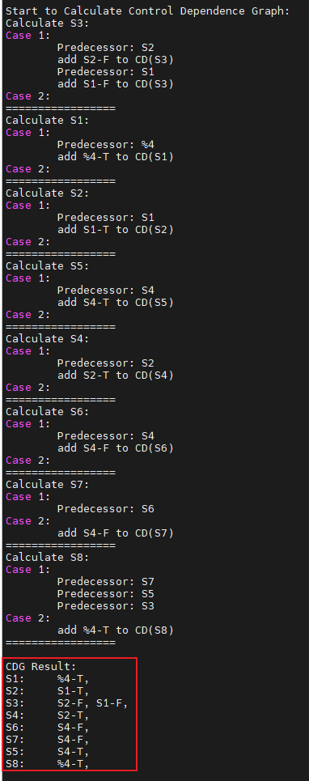
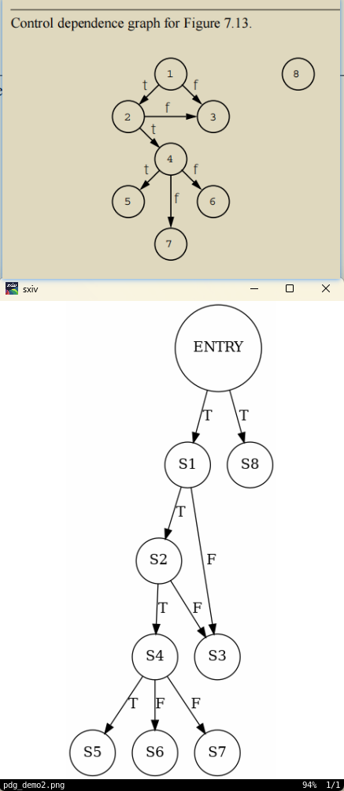
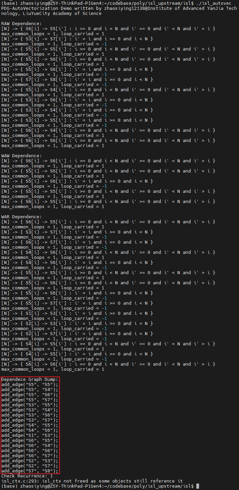
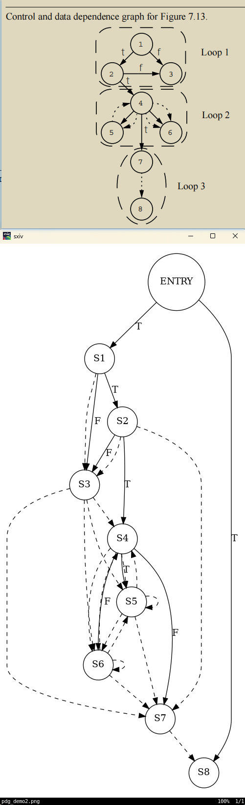
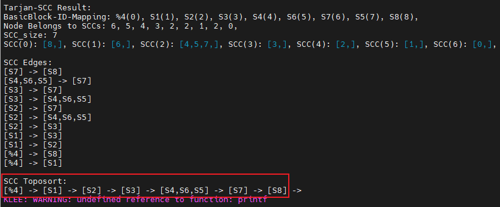
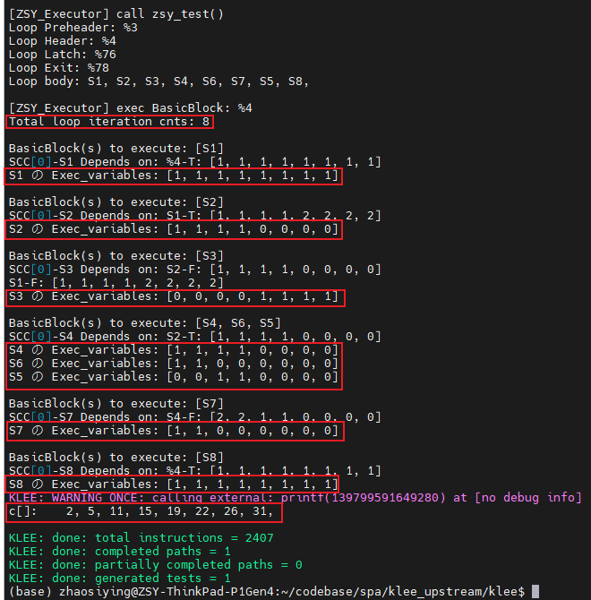
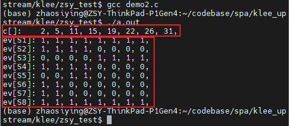
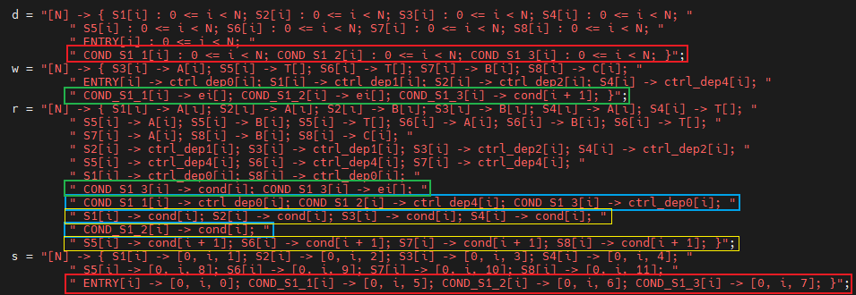
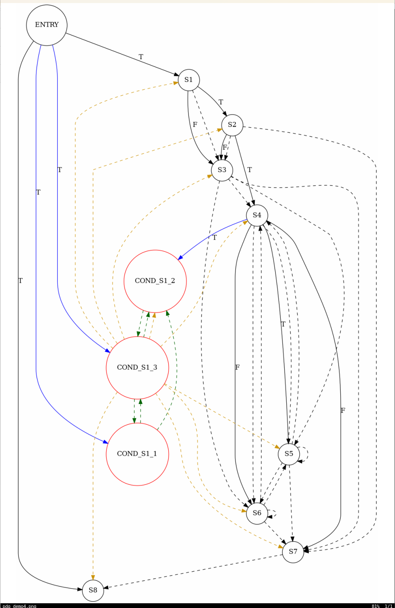
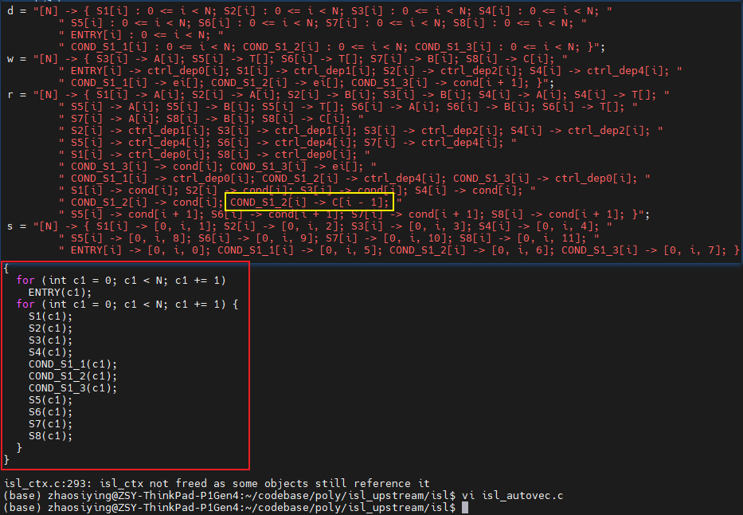

# PDG AutoVectorization  
A toy auto-vectoraization implementation about the application of **Program Dependence Graph** using LLVM by zhaosiying12138.  
It can do auto-vectoraization when **control flow exists** since its **If-Conversion** algorithm can **treat Control Dependence as Data Dependence**.

## 1. File Organization  
***lib/Module/PDGAnalysis.cpp:*** an LLVM Analysis Pass to generate PDG information from LLVM IR;  
***lib/Module/Tarjan_SCC.cpp:*** an utility class to calculate SCC of PDG;  
***lib/Module/isl_ddg_analysis.c:*** an utility program to calculate Data Dependence Graph(DDG) to construct PDG, however, **since I haven't integrate ISL into KLEE（我不会，斯米马赛~~）**, you need put this file into the ISL source code dictionary and compile, for more information please visit: https://github.com/zhaosiying12138/isl and [《零基础入门依赖环的检测》-流霞祭司曌鹓鶵](https://zhuanlan.zhihu.com/p/649953141);  
***lib/Core/PDGExecutor.cpp:*** modification on klee executor to executor loops of LLVM IR in a **Loop-Distribution-Form** automatically;  
***zsy_test/demo2\_3.ll:*** the demo LLVM IR executed to test the overall algorithm;  
***zsy_test/demo3\_3.ll:*** the demo LLVM IR executed to test CDG Construction algorithm only;  
***zsy_test/demo4.c:*** the demo C source code to show the principle of the PDG-AutoVec algorithm;  

## 2. Usage  
### Step 1: Make a testfile (You can skip this step if you would like to use [zsy_test/demo2_3.ll] provided for you if you just want to learn the principle of PDG_AutoVec)  
```
clang -Xclang -disable-O0-optnone -S -O0 -emit-llvm demo1.c -o demo1_1.ll  
opt -S -mem2reg demo1_1.ll -o demo1_2.ll  
opt -S -loop-simplify demo1_2.ll -o demo1_3.ll  
```

### Step 2: Build modified KLEE  
```
mkdir build  
cd build  
cmake .. -DCMAKE_BUILD_TYPE=Debug -DENABLE_SOLVER_Z3=ON -DZ3_INCLUDE_DIRS=/your-z3-dir/include/ -DZ3_LIBRARIES=/your-z3-dir/lib/libz3.so -DLLVM_DIR=/your-llvm-dir/  
make -j 65535  
```

### Step 3: Execute the LLVM IR using KLEE  
```
build/bin/klee zsy_test/demo2_3.ll  
```

## 3. Experimental Results  
### 1. CDG Construction  
  
  
### 2. DDG Construction  
  
### 3. PDG Construction & Cut SCC & Toposort
  
  
### 4. KLEE Execution Result  
  
  
### 5. Algorithm Extension when Exit Branch exits  
  
  
  
  

## 4. Link  
[《零基础入门控制依赖图构建的理论与实践》-流霞祭司曌鹓鶵](https://zhuanlan.zhihu.com/p/658705992)  

## 5. Copyright  
Copyright (c) 2023 By 流月城先进偃甲技术研究院-对伏羲外包国家重点实验室-流霞祭司曌鹓鶵 founded by 五色石炼制关键工艺天界自然科学基金(2022LYC12138).  All rights reserved.  
